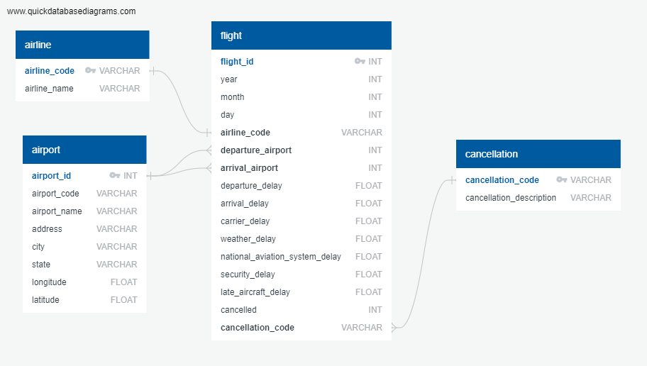

# Flight Delays and Cancellations
​
By Qixuan Wang, Maryam Tabatabaei, Karly Ringstad and John Jostes 6/11/2020 

​
  Our challenge for Project 2 was to create a full stack application with an assigned group of 4.
The application we created utilizes:
* A postgreSQL database from AWS
* Python for ETL 
* FLASK API to render data from the database to the front-end application
* HTML/JS/CSS using D3.js, d3.delaunay, d3.geo-voronoi, plotly.js and leaflet.js for the webpage and visualizations
* Heroku cloud platform to deploy our app 

​
​# Project description:
  For this project, we looked at flight delays for airports in the United States during March 2019 and March 2020. 
This was chosen to see what impact COVID-19 may have had compared to the previous year.
​
  We utilized data from the Bureau of Transportation Statistics, which were uploaded to our postgresSQL.

​
# ERD
  
  
# Web Page
​
  Our dashboard was modified from the following template. Click [here](https://startbootstrap.com/themes/grayscale/)  (MIT License)
​
# Visualizations
​
Each graph include the ability to switch between March 2019 and March 2020. 

* Plot 1: Map of the U.S. with an edge bundling layer that shows airline flight routes, with thicker edges corresponding to longer delays.
​
* Plot 2: Another U.S. map. Here, Leaflet is used to represent delays with a bubble chart that corresponds to both an airport's size (circle radius) and delay density (color).  
​
* Plot 3: A sub-dashboard that provides increased granularity by examining routes between selected airports.  
Details include a barchart showing flight delays by airline, number of airlines per flight route, average time of delays (both arrival and departure), cancellation rates, and the reason for delays. 
  
Click [here](https://flight-delay-2020.herokuapp.com/) to Deploy the Heroku app.
